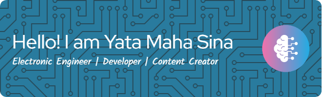

#### Hello World! I'm Yata Maha Sina 👋

<!--
**YataMahaSina/YataMahaSina** is a ✨ _special_ ✨ repository because its `README.md` (this file) appears on your GitHub profile.

Here are some ideas to get you started:

- 🔭 I’m currently working on ...
- 🌱 I’m currently learning ...
- 👯 I’m looking to collaborate on ...
- 🤔 I’m looking for help with ...
- 💬 Ask me about ...
- 📫 How to reach me: ...
- 😄 Pronouns: ...
- ⚡ Fun fact: ...
-->

- 🔭 I’m currently working on @RoboElectronics
- 🌱 I’m currently learning Flutter App

##### Skills

 

##### Connect with me
 

##### My Github Stats

<h3 align="center">🎯 Play game with Me! Lets Go 🎯</h3>

###

###